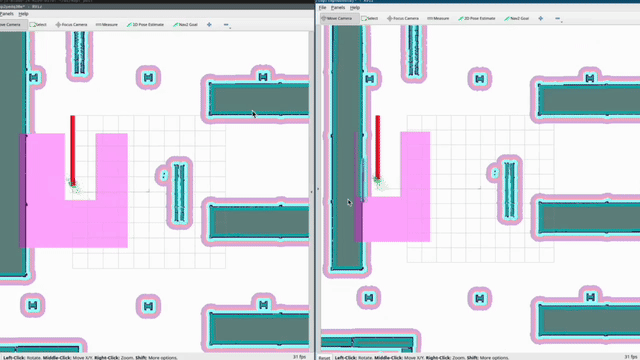
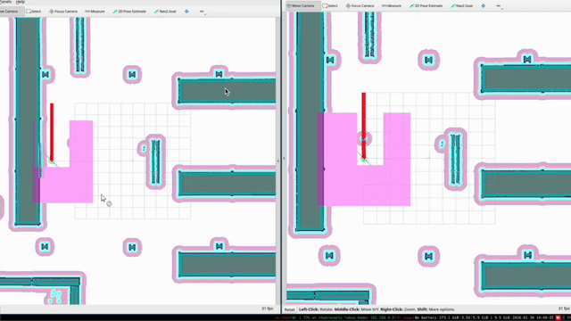

# Spatio-Temporal Partitioning Demo

A demonstration system for multi-robot path planning and navigation using spatio-temporal space partitioning. This repository contains the client-side simulation and navigation stack for coordinating multiple robots in shared environments.

> **Note:** This repository contains the *client implementation* for the spatio-temporal partitioning algorithm. The core algorithm lives in the [mapf_post](https://github.com/arjo129/mapf_post) repository.

## Overview

This demo showcases how multiple robots can safely and efficiently navigate in shared environments by dividing space-time into partitions. Each robot reserves specific regions of space during specific time intervals, enabling collision-free multi-agent path planning.

> **Status:** This is exploratory research work investigating spatio-temporal partitioning as a foundational approach for next-generation Open-RMF multi-robot coordination systems.

### Key Features

- **Multi-robot coordination** using spatio-temporal resource allocation
- **ROS 2 integration** with Nav2 for autonomous navigation
- **Gazebo simulation** support for testing in realistic environments
- **Flexible robot configuration** for various numbers of robots and starting positions
- **Dynamic scene modification** with collision-aware obstacles

### Demo Scenarios

The following GIFs show multi-robot navigation demonstrations:



*Figure 1: Multiple robots navigating efficiently using spatio-temporal partitioning.*



*Figure 2: Robot trajectory replanning when obstacles are introduced (dynamic rerouting).*

Notice how there is no need to trigger a replan despite the introduction of new obstacle directly in the path. The spatio-temporal allocation ensures that any detour remains safe.

## Requirements

- ROS 2 (Jazzy or later recommended)
- Nav2 stack
- Gazebo for simulation
- Turtlebot3 simulation packages
- Python 3.8+
- Cargo/Rust (for running the backend allocation server)

## Architecture

This demo consists of three main components:

1. **Client Demo** (this repository)
   - ROS 2 launch files and navigation configuration
   - Multi-robot simulation setup
   - Nav2 integration for path execution

2. **Allocation Server** ([mapf_post](https://github.com/arjo129/mapf_post))
   - Core spatio-temporal partitioning algorithm
   - REST API for space allocation requests
   - Trajectory validation

3. **MAPF Planner** (external)
   - Generates initial multi-robot trajectories
   - Examples: [mapf](https://github.com/open-rmf/mapf), [pibt_rs](https://github.com/arjo129/pibt_rs)

## Getting Started

### 1. Set Up the Allocation Server

The allocation server handles the space partitioning logic. Clone and run the mapf_post repository:

```bash
git clone git@github.com:arjo129/mapf_post.git
cd mapf_post
```

Generate or obtain a trajectory file (CSV format):

```bash
# Using pre-built example trajectories:
# See: https://github.com/arjo129/mapf_post/tree/main/example_trajectories

# Or generate trajectories using a MAPF planner:
# - https://github.com/open-rmf/mapf
# - https://github.com/arjo129/pibt_rs
```

Launch the REST API server:

```bash
cargo run --example rest_api -- -p <trajectory.csv>
```

> **Important:** Ensure your robots have appropriate safety buffers in the trajectory file to prevent collisions.

### 2. Start the Simulation

In a separate terminal, launch the multi-robot simulation:

```bash
ros2 launch nav2_bringup cloned_multi_tb3_simulation_launch.py \
  robots:="robot0={x: 0.0, y: 5.0, yaw: 0.0}; robot1={x: 3.0, y: 5.0, yaw: 0.0};"
```

The robot poses should correspond to the starting positions in your trajectory CSV file.

> **Tip:** Start the simulation before launching the REST server to avoid initialization issues.

### 3. Add Dynamic Obstacles (Optional)

To test dynamic replanning with obstacles, add models to the scene:

```bash
gz service -s /world/warehouse/create \
  --reqtype gz.msgs.EntityFactory \
  --reptype gz.msgs.Boolean \
  --timeout 300 \
  --req 'sdf: "<sdf version=\"1.6\"><model name=\"inline_cube\"><pose>1.6 5.6 0 0 0 0</pose><static>true</static><link name=\"link\"><visual name=\"v\"><geometry><box><size>0.2 0.2 1</size></box></geometry></visual><collision name=\"c\"><geometry><box><size>1 1 1</size></box></geometry></collision></link></model></sdf>"'
```

Alternatively, use the provided script to generate multiple obstacles:

```bash
./clutter_gen.sh
```

## Deploying on real robots

By default the rest server runs on port 3000 on localhost. If youd like to change this you can use the environment variable
```bash
export SP_SERVER_BASE="www.your-fleet-server.com:8443" # Note do not terminate with "/"
```
This will allow you to deploy this to nav2 robots without a problem.


## Project Structure

```
spatio_temporal_partitioning/
├── nav2_bringup/           # Nav2 launch files and robot configurations
├── spatio_temporal_partition_layer/  # ROS 2 costmap layer plugin
├── demo_world/             # Custom demo world and utilities
├── docs/                   # Documentation and images
└── clutter_gen.sh         # Script for generating test obstacles
```

## Configuration

Modify the following files to customize the demo:

- **Robot parameters**: `nav2_bringup/params/nav2_params.yaml`
- **Multi-robot configuration**: `nav2_bringup/params/nav2_multirobot_params_*.yaml`
- **Available maps**: `nav2_bringup/maps/` (depot, warehouse, sandbox)

## Version Notes

- ROS 2 Jazzy is recommended for this demo
- If using ROS 2 Rolling with the `simple_nav` API, compatibility issues may arise with earlier implementations

## Citation

The associated research paper is currently under peer review. Citation information will be provided once the paper has been accepted and published.

## License

See [LICENSE](LICENSE) for licensing information.

## Contributing

Contributions and feedback are welcome. Please open an issue or submit a pull request.

## References

- [Nav2 Documentation](https://docs.nav2.org/)
- [mapf_post Repository](https://github.com/arjo129/mapf_post)
- [ROS 2 Documentation](https://docs.ros.org/)


